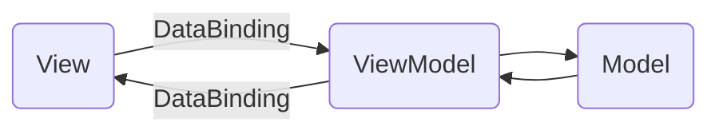

# S2.01_G3_A

## Contributeurs
Enzo BEDOS --> [**N0cly**](https://github.com/N0cly) / [**EnzoBEDOS22002844**](https://github.com/EnzoBEDOSB22002844)

Rayane BELABBAS --> [**RB_Biila**](https://github.com/RayaneBELABBASB22013685)  / RayaneBELABBASB22013685

Noah HENRICY --> [**HENRICY Noah**](https://github.com/NoahHENRICYH22008738) / NoahHENRICY22008738

Yoni SAFRAN --> [**Yonisfrn**](https://github.com/YoniSAFRANS22002518) / YoniSAFRANS22002518

# Fichiers

- `.idea`
- `.mvn/wrapper`
-  `src/main`
-  `.gitignore`
-  `README.md`
-  `mvnw`
-  `mvnw.cmd`
-  `pom.xm`

## Structure du projet
```markdown
├── src/main
│   ├── java
│   │   ├── com/example/s201_g3_a
│   │   │   ├── SisFranceApp.java
│   │   │   ├── SisFranceModel.java
│   │   │   ├── SisFranceView.java
│   │   │   ├── SisFranceViewModel.java
│   │   │   ├── CustomMapLayer.java
│   │   ├── module-info.java
│   ├── resources/com/example/s201_g3_a
│   │   ├── SisFrance-view.fxml
│   │   ├── SisFrance_seisme.csv
│   │   ├── style.css
```


## MVVM
Le **Model-View-ViewModel** (MVVM) est un schéma d'architecture qui facilite la séparation et le développement d'interface graphique .

